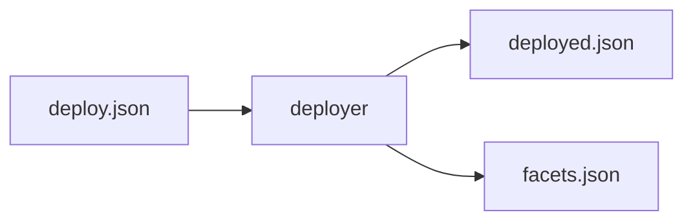

# Gemforce Configuration

This document describes the configuration steps required to deploy the Gemforce application.

1. Configure Gemforce server settings - this is done by setting the appropriate environment variables. See the [Server](#server) section for more information.

1. Deploy the Smart Contracts - this happens once, and is described in the [Smart Contracts](#smart-contracts) section. This step deploys all the smart contracts required for the application to function. Typically this is done by running: `npx hardhat deploy --network <network>`, where `<network>` is the network to deploy to. For example, to deploy the `diamond` and `tokensale` contracts to the `rinkeby` network, you would run: `npx hardhat deploy --network rinkeby`. To find out how to configure the deployment process, see the [Deployment](#deployment) section.

2. Start the Gemforce Server - Starting the Gemforce server creates the Gemforce database collection on first-run. This is done by running: `bin/gemforce`. This command will start the server and create the database collection. To find out how to configure the server, see the [Server](#server) section.

## Server

The Gemforce server is configured using environment variables. The following environment variables are available:

| Variable | Description | Default |
| --- | --- | --- |
| `APP_NAME` | The name of the application. | `GemForce` |
| `APPLICATION_ID` | The application ID used by Parse. | `gemForce` |
| `MASTER_KEY` | The master key used by Parse. | `gemForceMasterKey` |
| `SERVER_URL` | The URL of the server. | `http://localhost:1337/parse` |
| `REPORT_GAS` | Whether to report gas usage when deploying contracts. | `true` |
| `METADATA_BASE_URI` | The base URI for token metadata. | `http://localhost:1337/metadata/` |
| `NETWORK_HOST` | The host address of the server. | `localhost` |
| `NETWORK_PORT` | The port to use for the server. | `1337` |
| `HTTPS_PORT` | The port to use for HTTPS connections. | `1338` |
| `HTTPS_ENABLED` | Whether to enable HTTPS connections. | `false` |
| `KEY_FILE` | The path to the key file for HTTPS connections. | `./privatekey.pem` |
| `CERT_FILE` | The path to the certificate file for HTTPS connections. | `./certificate.pem` |
| `MONGODB_URL` | The URL of the MongoDB database. | `mongodb://localhost:27017/gemforce` |
| `NODE_TLS_REJECT_UNAUTHORIZED` | Whether to reject unauthorized TLS connections. | `0` |

## Deployment

The deployer is responsible for loading a configuration file which contains a number of deployment directives. Each directive deploys a single Diamond (along with its associated facets) and then executes a function on the Diamond to initialize it. The deployer then saves the address of the Diamond in a file for later use. 



The configuration for deployment is stored in the `../config/deploy.json` file. Each deploy directive has the following format: 

```json
{
    "name": "Diamond Name",
    "description": "Description of the Diamond",
    ("facets": [
        "Facet Name 1",
        "Facet Name 2",
        ...
    ], OR "facetSet": "Facet Set Name"),
    "init": [{
        "function": "function name",
    }] 
} 
``` 

If a file called `../config/sets.json` exists, it will be loaded and used to resolve facet set names to facet names. The format of the file is: 

```json 
 { 
     "Facet Set Name": [ 
         "Facet Name 1", 
         "Facet Name 2", 
         ...  ] }   
```

The deployer will load the `../config/deploy.json` file and deploy each Diamond in the file. The deployer will then save the address of each deployed Diamond in a file called `../config/deployed.json`. The format of the file is: 

```json 
 { 
     "Diamond Name": "0x1234567890abcdef1234567890abcdef12345678" 
 } 
```

The deployer will also save the address of each deployed facet in a file called `../config/facets.json`. The format of the file is: 

```json 
 { 
     "Facet Name": "0x1234567890abcdef1234567890abcdef12345678" 
 } 
```

